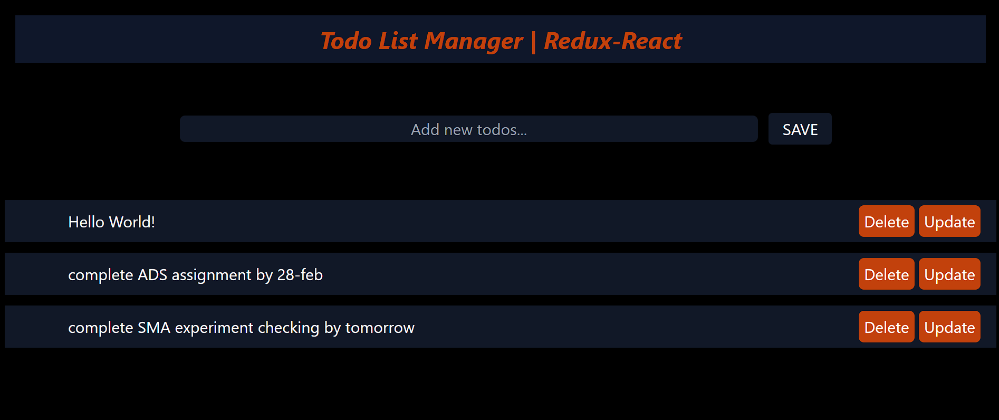

# HELLO COLDRES, SANIT HERE
# MINI PROJECT - TODO LIST MANAGER USING REACT-REDUX
hello everyone, this project demonstrate how can we use Redux for state management
in this project we have done simple CREATE, READ, UPDATE AND DELETE OPERATION 
# this is ouput image of project 

<sanit patil>